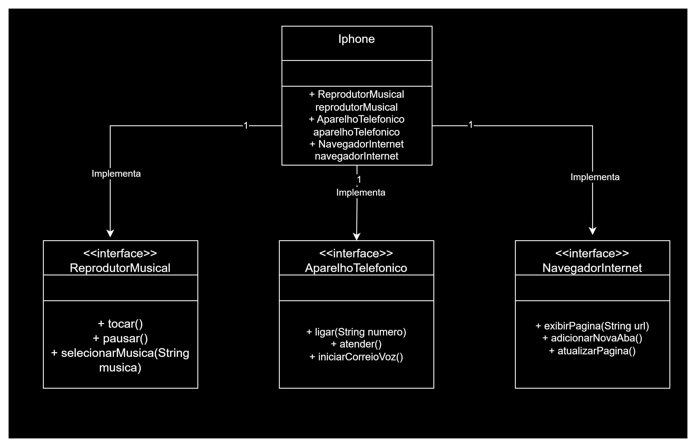

# POO - Desafio: Modelagem e Diagramação de um Componente iPhone

Neste desafio, você será responsável por modelar e diagramar a representação UML do componente iPhone, abrangendo suas funcionalidades como Reprodutor Musical, Aparelho Telefônico e Navegador na Internet.

## Contexto

Com base no vídeo de lançamento do iPhone de 2007 (link abaixo), você deve elaborar a diagramação das classes e interfaces utilizando uma ferramenta UML de sua preferência. Em seguida, implemente as classes e interfaces no formato de arquivos .java.

[Lançamento iPhone 2007](link_do_vídeo)

Minutos relevantes: 00:15 até 00:55

## Funcionalidades a Modelar

### Reprodutor Musical
- Métodos:
  - tocar()
  - pausar()
  - selecionarMusica(String musica)

### Aparelho Telefônico
- Métodos:
  - ligar(String numero)
  - atender()
  - iniciarCorreioVoz()

### Navegador na Internet
- Métodos:
  - exibirPagina(String url)
  - adicionarNovaAba()
  - atualizarPagina()

## Objetivo

- Criar um diagrama UML que represente as funcionalidades descritas acima.
- Implementar as classes e interfaces correspondentes em Java (Opcional).

Exemplo de Diagrama UML (Mermaid):
classDiagram
    class ReprodutorMusical {
        +exemploMetodo1()
        +exemploMetodo2(String exemplo)
    }

    class AparelhoTelefonico {
        +exemploMetodo1()
        +exemploMetodo2(String exemplo)
    }

    class NavegadorInternet {
        +exemploMetodo1()
        +exemploMetodo2(String exemplo)
    }

    class iPhone {
    }

    iPhone --> ReprodutorMusical
    iPhone --> AparelhoTelefonico
    iPhone --> NavegadorInternet

# Instruções

1. Assista ao vídeo do lançamento do iPhone para entender as funcionalidades principais.
2. Utilize uma ferramenta UML de sua preferência para criar o diagrama das classes e interfaces. Você pode utilizar o modelo acima (criado na sintaxe Mermaid), uma alternativa open-source e compatível com arquivos Markdown como este.
3. Opcionalmente, caso esteja confiante, pode implementar as classes Java representadas em seu diagrama UML.
4. Submeta seu repositório GitHub conforme as orientações da plataforma DIO.

# Solução
