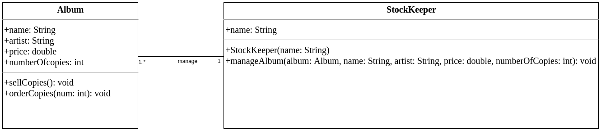
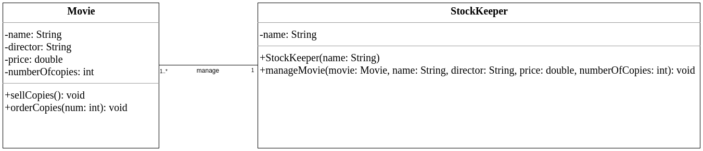
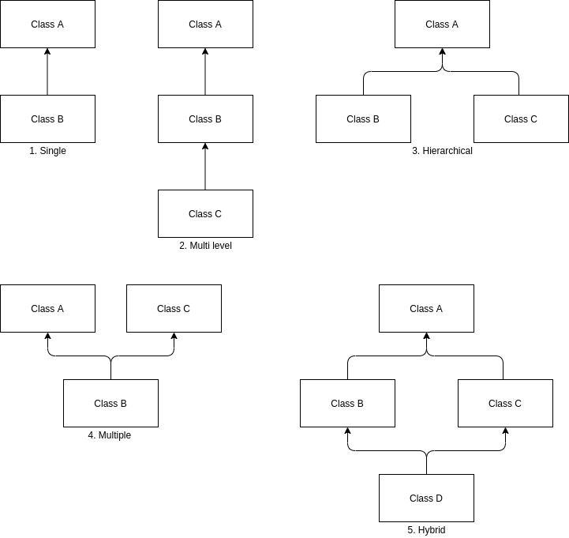
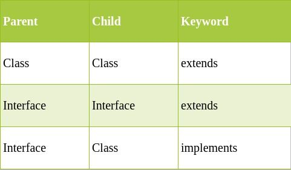
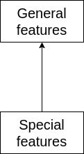
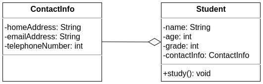
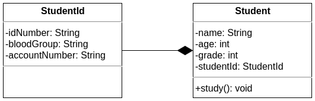
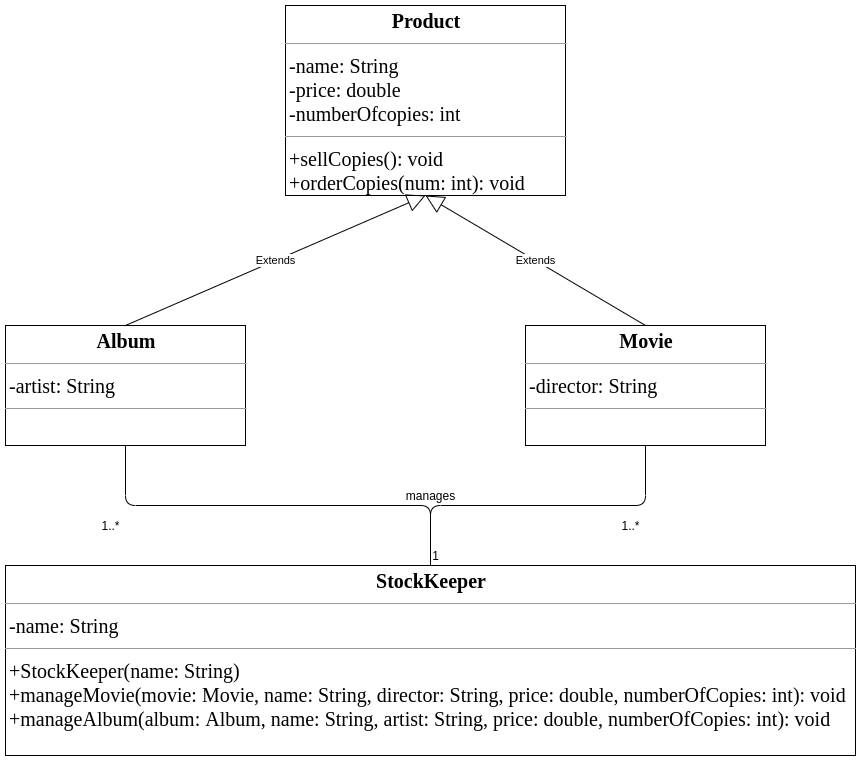
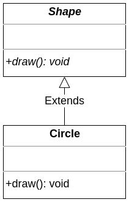
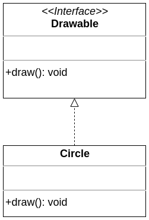

### Princípios de Programação Orientada a Objetos

A programação orientada a objetos é um paradigma de programação onde tudo é representado como um objeto.

Objetos passam mensagens uns para os outros. Cada objeto decide o que fazer com uma mensagem recebida. A POO (em inglês, OOP - Object Oriented Programming) foca nos estados e comportamentos de cada objeto.

#### O que são objetos?

Um objeto é uma entidade que possui estados e comportamentos.

Por exemplo, cão, gato e veículo. Para ilustrar, um cão possui estados como idade, cor, nome e comportamentos como comer, dormir e correr.

Os estados nos dizem como o objeto se parece ou quais propriedades ele possui.

O comportamento nos diz o que o objeto faz.

Podemos representar um cão do mundo real em um programa como um objeto de software definindo seus estados e comportamentos.

Objetos de software são uma representação de um objeto do mundo real. É alocado espaço em memória sempre que um objeto lógico é criado.

Um objeto pode também ser referenciado como uma instância de uma classe. Instanciar uma classe significa a mesma coisa que criar um objeto.

Algo importante de se lembrar quando estamos criando um objeto é: o tipo de referência deve ser do mesmo tipo ou um supertipo do tipo do objeto. Veremos o que é um tipo de referência mais a frente neste artigo.

#### O que são classes?

Uma classe é um template - algo como a "planta" de uma construção - a partir do qual os objetos são criados.

Imagine uma classe como um cortador de biscoitos e os objetos como os próprios biscoitos.


### Classes, Variáveis de Instância e Métodos de Instância

Classes definem estados como variáveis de instância e comportamentos como métodos de instância.

Variáveis de instância também são conhecidas como "variáveis membro".

Classes não consomem espaço em memória.

### Exemplo: Classe Cat (Gato)

Para exemplificar o conceito de classes e objetos, vamos criar uma classe `Cat` (Gato) que representa estados e comportamentos de um gato no mundo real.

```java
public class Cat {
    // Variáveis de instância
    private String name;
    private int age;
    private String color;

    // Construtor
    public Cat(String name, int age, String color) {
        this.name = name;
        this.age = age;
        this.color = color;
    }

    // Métodos de instância
    public void meow() {
        System.out.println("O gato " + name + " está miando.");
    }

    public void sleep() {
        System.out.println("O gato " + name + " está dormindo.");
    }

    // Outros métodos...
} 
```


### Criando Objetos da Classe Cat

Agora que definimos um template de gatos, vamos dizer que temos dois gatos, chamados Thor e Rambo. Como podemos defini-los em nossos programas?

Primeiro, precisamos criar dois objetos da classe `Cat`.


```java
public class Main {
    public static void main(String[] args) {
       Cat thor = new Cat();
       Cat rambo = new Cat();
    }
}
```

### Agora, vamos definir seus estados e comportamentos.

```java
public class Main {

    public static void main(String[] args) {
       /*
       Criando os objetos
        */
       Cat thor = new Cat();
       Cat rambo = new Cat();

       /*
       Definindo o gato Thor
        */
       thor.name = "Thor";
       thor.age = 3;
       thor.breed = "Azul russo";
       thor.color = "Marrom";

       thor.sleep();

       /*
       Definindo o gato Rambo
        */
       rambo.name = "Rambo";
       rambo.age = 4;
       rambo.breed = "Maine Coon";
       rambo.color = "Marrom";

       rambo.play();
    }

}
```
Como nos exemplos de código acima, podemos definir nossas classes, instanciá-las (criar objetos) e especificar os estados e comportamentos para esses objetos.

Até aqui já cobrimos o básico de orientação a objetos. Vamos avançar para os princípios da orientação a objetos.

Princípios da programação orientada a objetos
Esses são os quatro princípios fundamentais do paradigma de programação orientada a objetos. Entendê-los é essencial para se tornar um programador de sucesso.

Encapsulamento
Herança
Abstração
Polimorfismo
Agora, vamos dar uma olhada neles com mais detalhes.

Encapsulamento
Encapsulamento é um processo de envolver dados e código em uma única unidade.

É como uma capsula que possui uma mistura de diversos medicamentos, é uma técnica que ajuda a manter as variáveis de instância protegidas.

Essa proteção pode ser conquistada utilizando o modificador de acesso private, que indica que a variável ou dado não pode ser acessado de fora da classe. Para acessar estados privados de modo seguro, temos que providenciar métodos getters e setters públicos (em Java, esses métodos devem seguir os padrões de nomenclatura "JavaBeans").

Digamos que existe uma loja de discos que vende álbuns de músicas de diferentes artistas e um estoque para o gerenciamento.



Se você observar a figura 4, a classe StockKeeper pode acessar os estados da classe Album diretamente, já que os atributos da classe Album estão definidos como public (sinal de +).

Se o gerenciador de estoque criar um álbum e definir seus estados como negativos, ele pode acabar fazendo isso mesmo que sem intenção.

Para ilustrar, vamos ver um exemplo de um programa em Java que explica o diagrama e a afirmação acima.

Classe Album:

```java
public class Album {
    public String name;
    public String artist;
    public double price;
    public int numberOfCopies;
    public void sellCopies(){
        if(numberOfCopies > 0){
            numberOfCopies--;
            System.out.println("Um album foi vendido!");
        }
        else{
            System.out.println("Não há albuns disponíveis!");
        }
    }
    public void orderCopies(int num){
        numberOfCopies += num;
    }
}
```

Classe StockKeeper: 


```java
public class StockKeeper {
    public String name;
    public StockKeeper(String name){
        this.name = name;
    }
    public void manageAlbum(Album album, String name, String artist, double price, int numberOfCopies){
      /*
       Definindo os estados e comportamentos para album
       */
        album.name = name;
        album.artist = artist;
        album.price = price;
        album.numberOfCopies = numberOfCopies;

       /*
       Imprimindo os detalhes do album
        */
        System.out.println("Album gerenciado por :"+ this.name);
        System.out.println("Detalhes do album::::::::::");
        System.out.println("Nome do album: " + album.name);
        System.out.println("Artista do Album : " + album.artist);
        System.out.println("Preço do Album : " + album.price);
        System.out.println("Número de cópias do album : " + album.numberOfCopies);
    }
}
```

Classe Main:

```java
public class Main {
    public static void main(String[] args) {
       StockKeeper johnDoe = new StockKeeper("John Doe");
       /*
       O gerenciador de estoque cria um album e atribui valores negativos para o preço e o numero de cópias disponíveis
        */
       johnDoe.manageAlbum(new Album(), "Slippery When Wet", "Bon Jovi", -1000.00, -50);
    }
}
```

Saída:

```java
Album gerenciado por :John Doe
Detalhes do album::::::::::
Nome do album : Slippery When Wet
Artista do Album : Bon Jovi
Preço do Album :  -1000.0
Número de cópias do album : -50
O preço do álbum e número de cópias não podem ser valores negativos. Como podemos evitar essa situação? Aqui é onde usamos o encapsulamento.
```


Neste cenário, podemos impedir o gerenciador de estoque de atribuir valores negativos. Se ele tentar atribuir valores negativos para o preço e o número de cópias do álbum, definiremos 0.0 como o valor e 0 como o número de cópias.

Classe Album:

```java
public class Album {
    private String name;
    private String artist;
    private double price;
    private int numberOfCopies;
    public void sellCopies(){
        if(numberOfCopies > 0){
            numberOfCopies--;
            System.out.println("Um álbum foi vendido!");
        }
        else{
            System.out.println("Nenhum álbum disponível!");
        }
    }
    public void orderCopies(int num){
        numberOfCopies += num;
    }
   public String getName() {
      return name;
   }
   public void setName(String name) {
      this.name = name;
   }
   public String getArtist() {
      return artist;
   }
   public void setArtist(String artist) {
      this.artist = artist;
   }
   public double getPrice() {
      return price;
   }
   public void setPrice(double price) {
      if(price > 0) {
         this.price = price;          
      }
      else {
         this.price = 0.0;
      }
   }
   public int getNumberOfCopies() {
      return numberOfCopies;
   }
   public void setNumberOfCopies(int numberOfCopies) {
      if(numberOfCopies > 0) {
         this.numberOfCopies = numberOfCopies;        
      }
      else {
         this.numberOfCopies = 0;
      }
   }
}
```


Classe StockKeeper:

```java
public class StockKeeper {
    private String name;
    StockKeeper(String name){
        setName(name);
    }
    public void manageAlbum(Album album, String name, String artist, double price, int numberOfCopies){
         /*
          Definindo estados e comportamentos para o album
          */
        album.setName(name);
        album.setArtist(artist);
        album.setPrice(price);
        album.setNumberOfCopies(numberOfCopies);
          /*
          Imprimindo os detalhes do album
           */
        System.out.println("Album gerenciado por :"+ getName());
        System.out.println("Detalhes do album::::::::::");
        System.out.println("Nome do album : " + album.getName());
        System.out.println("Artista do Album : " + album.getArtist());
        System.out.println("Preço do Album : " + album.getPrice());
        System.out.println("Número de cópias do album : " + album.getNumberOfCopies());
    }
    public String getName() {
        return name;
    }
    public void setName(String name) {
        this.name = name;
    }
}
```

Classe Main:

```java
public class Main {
    public static void main(String[] args) {
       StockKeeper johnDoe = new StockKeeper("John Doe");
       /*
       Gerenciador de estoque cria um album e atribui valores negativos para o preço e o número de cópias disponíveis do album
        */
       johnDoe.manageAlbum(new Album(), "Slippery When Wet", "Bon Jovi", -1000.00, -50);
    }
}
```

Saída:

```java
Album gerenciado por :John Doe
Detalhes do album::::::::::
Nome do album : Slippery When Wet
Artista do Album : Bon Jovi
Preço do Album : 0.0
Número de cópias do album : 0
Com o encapsulamento, impedimos nosso gerenciador de estoque de definir valores negativos, o que significa que temos o controle sobre as informações.
```


Vantagens do encapsulamento em Java

Podemos fazer uma classe somente leitura ou somente escrita. Para uma classe somente leitura, temos que informar apenas os métodos getters. Para uma classe somente escrita, devemos informar apenas os métodos setters.
Controle sobre os dados: podemos controlar os dados adicionando lógica nos métodos setters, assim como fizemos para evitar que o gerenciador de estoques definisse valores negativos nos exemplos acima.
Proteção dos dados: outras classes não podem acessar membros privados de uma classe diretamente.


Herança

Consideremos que a loja de discos que falamos anteriormente também venda filmes em Blu-ray.



Como você pode ver no diagrama acima, existem muitos estados e comportamentos em comum (código duplicado) entre Album e Movie.

Quando for transformar esse diagrama de classes em código, você vai reescrever/copiar todo o código novamente para Movie? Caso você faça isso, você estará se repetindo. Como você pode evitar a duplicação de código?

Aqui é onde usamos a herança.

Herança é um mecanismo onde um objeto recebe todos os comportamentos e estados de um objeto pai.

A herança utiliza um relacionamento de pais e filhos (relacionamento "É um" ).

Então o que exatamente é herdado?

Visibilidade/modificadores de acesso impacta o que pode ser herdado de uma classe para a outra.

Em Java, como regra fundamental, tornamos as varáveis de instância private e os métodos de instância public.

Neste caso, certamente podemos dizer que o seguinte será herdado:

métodos públicos de instância.
variáveis de instância privadas (que podem ser acessadas apenas por meio de métodos getters e setters públicos) .
Tipos de herança no Java
Existem cinco tipos diferentes de herança no Java. Elas são:  simples, multinível, hierárquica, múltipla e híbrida.

Classes permitem heranças simples, multinível e hierárquicas. Interfaces permitem heranças múltiplas e híbridas.



Uma classe pode estender apenas uma classe. Entretanto, não há limite para a implementação de interfaces. Uma interface pode estender mais de uma interface.



Relacionamentos
I. Relacionamento É UM

Um relacionamento É UM refere-se à herança ou implementação.

a. Generalização
Generalização usa um relacionamento É UM de uma classe especializada para uma classe generalizada.



II. Relacionamento TEM UM
Uma instância de uma classe TEM UMA referência para uma instância de outra classe.

a. Agregação
Neste relacionamento, a existência de uma classe A e B não são dependentes umas das outras.

Para essa parte de agregação, vamos ver um exemplo da classe Student e da classe ContactInfo.

```java
class ContactInfo {
    private String homeAddress;
    private String emailAddress;
    private int telephoneNumber; //12025550156
}
public class Student {
    private String name;
    private int age;
    private int grade;
    private ContactInfo contactInfo;//Student TEM UM ContactInfo
    public void study() {
        System.out.println("Study");
    }
}
```




Student (aluno) TEM UMA ContactInfo (informação de contato). ContactInfo pode ser usado em outros lugares – por exemplo, uma classe Employee (funcionário) de um companhia também poderia utilizar a classe ContactInfo. Assim, Student pode existir sem ContactInfo e ContactInfo pode existir sem Student. Este tipo de relacionamento é conhecido como agregação.

b. Composição
Neste relacionamento, a classe B não pode existir sem uma classe A – mas a classe A pode existir sem a classe B.

Para dar uma ideia sobre composição, vamos ver esse exemplo da classe Student e a classe StudentId.

```java
class StudentId {
    private String idNumber;//A-123456789
    private String bloodGroup;
    private String accountNumber;
}
public class Student {
    private String name;
    private int age;
    private int grade;
    private StudentId studentId;//Student TEM UM StudentId
    public void study() {
        System.out.println("Study");
    }
}
```



Student TEM UM StudentId. Student pode existir sem StudentId, mas StudentId não pode existir sem Student. Esse tipo de relacionamento é conhecido como composição.

Agora, vamos voltar para nosso exemplo da loja de discos que discutimos acima.



Podemos implementar esse diagrama em Java para evitar duplicação de código.

Vantagens de se usar herança

Reaproveitamento de código: as classes filhas herdam todos os membros de instância da classe pai.
Você tem mais flexibilidade de mudar o código: mudar o código em um lugar é o suficiente.
Você pode usar polimorfismo: a sobrescrita de métodos requer um relacionamento É UM.
Abstração
Abstração é o processo de esconder os detalhes de implementação e exibir apenas as funcionalidades para o usuário.

Um exemplo comum de abstração é o acelerador do carro: pisando mais forte, você aumenta a velocidade. Os motoristas, no entanto, não sabem como essa ação altera a velocidade – eles não precisam saber.

Tecnicamente, abstrato significa algo incompleto ou a ser finalizado no futuro.

Em Java, podemos obter abstração de duas maneiras: classes abstratas (0% a 100%) e interfaces (100%).

A palavra-chave abstract pode ser aplicada à classes e métodos. abstract e final ou static nunca podem estar juntas.

I. Classes abstratas
Uma classe é abstrata quando ela contém a palavra reservada abstract.

Classes abstratas não podem ser instanciadas  (não é possível criar objetos de classes abstratas). Elas podem ter construtores, métodos estáticos e métodos finais.

II. Métodos abstratos
Um método é abstrato quando ele contém a palavra chave abstract.

Um método abstrato não possui implementação (não possui um corpo e termina com ponto e virgula). Métodos abstratos não devem ser marcados como private.

III. Classes abstratas e métodos abstratos
Se pelo menos um método for abstrato dentro de uma classe, então toda a classe deve ser abstrata.
É possível ter uma classe abstrata sem nenhum método abstrato.
Podemos ter qualquer quantidade de métodos abstratos e não abstratos ao mesmo tempo na mesma classe.
A primeira classe concreta que herde de uma classe abstrata deve prover implementação para todos os métodos abstratos.
Caso a subclasse não implemente os métodos abstratos da superclasse, ela deve também ser marcada como abstrata.
Em um cenário real, a implementação vai ser feita por alguém desconhecido ao usuário final. Usuários não conhecem a classe de implementação nem os detalhes da implementação.

Vamos considerar um exemplo de uso do conceito de classes abstratas.

```java
abstract class Shape {
    public abstract void draw();
}
class Circle extends Shape{
    public void draw() {
        System.out.println("Círculo!");
    }
}
public class Test {
    public static void main(String[] args) {
        Shape circle = new Circle();
        circle.draw();
    }
}
```




Quando vamos querer marcar uma classe como abstrata?
Para forçar subclasses a implementar métodos abstratos.
Para impedir que existam objetos daquela classe.
Para manter a referência à uma classe.
Para manter código comum.


Interface


Uma interface é um template (ou uma "planta" de construção) de uma classe.

Uma interface é 100 abstrata. Construtores não são permitidos aqui. A interface representa o relacionamento "É UM".

Observação: interfaces apenas definem quais os métodos necessários. Não podemos manter código comum.

Uma interface possui apenas métodos abstratos, não possui métodos concretos. Os métodos da interface são, por padrão, public e abstract. Então, dentro da interface, não precisamos especificar as palavras-chaves public e abstract.

Então, quando uma classe implementa um método da interface sem especificar os modificadores de acesso daquele método, o compilador vai lançar uma exceção dizendo "Cannot reduce the visibility of the inherited method from interface" (Não é possível reduzir a visibilidade de um método herdado de uma interface). Sendo assim, o modificador de acesso de um método implementado de uma interface deve ser public.

Por padrão, as variáveis de interface são public, static e final.

Por exemplo:

```java
interface Runnable {
    int a = 10; //equivale a: public static final int a = 10;
    void run(); //equivale a: public abstract void run();
}
public class InterfaceChecker implements Runnable{
    public static void main(String[] args) {
        Runnable.a = 5;//o valor do campo final Runnable.a não pode ser reatribuido.
    }
}
```

Vamos ver um exemplo que explica o conceito de interface:

```java
interface Drawable {
    void draw();
}
class Circle implements Drawable{
    public void draw() {
        System.out.println("Círculo!");
    }
}
public class InterfaceChecker {
    public static void main(String[] args) {
        Drawable circle = new Circle();
        circle.draw();
    }
}
```



Métodos default e métodos estáticos nas Interfaces
Normalmente, implementamos os métodos de uma interface em classes separadas. Digamos que seja necessário adicionar um novo método à interface. Então, deveremos implementar esse método em todas as outras classes que implementam essa interface também.

Para evitar esse tipo de problema, a partir do Java, 8 foi introduzida a possibilidade de implementar métodos default e estáticos dentro de uma interface, além dos métodos abstratos.

Método default

```java
public interface DefaultInterface {
    void sleep();
    default void run() {
        System.out.println("Estou correndo!");
    }
}
public class InterfaceCheckers implements DefaultInterface{
    public void sleep() {
        System.out.println("Dormindo...");
    }
    public static void main(String[] args) {
        InterfaceCheckers checker = new InterfaceCheckers();
        checker.run();
        checker.sleep();
    }
}
```
/*
Saída:
Estou correndo!
Dormindo...
 */


Métodos estáticos
Assim como métodos estáticos de classes, nós podemos chamá-los usando o nome da interface.

```java
public interface DefaultInterface {
    void sleep();
    static void run() {
        System.out.println("Estou correndo!");
    }
}
public class InterfaceCheckers implements DefaultInterface{
    public void sleep() {
        System.out.println("Dormindo...");
    }
    public static void main(String[] args) {
        InterfaceCheckers checker = new InterfaceCheckers();
        DefaultInterface.run();
        checker.sleep();
    }
}
```
/*
Saída:
Estou correndo!
Dormindo...
 */

Interface de marcação
São interfaces vazias. Por exemplo as interfaces Serializable, Cloneable e Remote.

```java
public interface Serializable 
{
  //Sem campos ou métodos
}

```

Vantagens das interfaces

Nos ajudam a utilizar herança múltipla no Java.
Elas fornecem abstração.
Elas fornecem baixo acoplamento: os objetos são independentes uns dos outros.
Quando vamos querer mudar de uma classe para uma interface?
Para forçar subclasses a implementar métodos abstratos.
Para evitar a criação de objetos dessa classe.
Para manter a referência à uma classe.
Observação: lembre-se de que não podemos manter código comum dentro de uma interface.

Caso você queira definir métodos que podem ser necessários e código comum, use uma classe abstrata.

Caso queira apenas definir métodos necessários, use uma interface.

Polimorfismo
Polimorfismo é a habilidade de um objeto de assumir diversas formas.

Polimorfismo em POO acontece quando uma superclasse faz referência a um objeto de uma subclasse.

Todos os objetos do Java são considerados polimórficos já que eles compartilham mais de um relacionamento É UM (pelo menos, todos os objetos vão passar no teste É UM para seu próprio tipo e para a classe Object).

Podemos acessar um objeto através de uma variável de referência. Uma variável de referência pode ser apenas de um tipo. Após declarada, o tipo da variável de referência não pode ser alterado.

Uma variável de referência pode ter uma classe ou uma interface como tipo.

Um único objeto pode ser referenciado por variáveis de referência de diversos tipos (desde que esses tipos estejam na mesma hierarquia), sendo o objeto do mesmo tipo da variável de referência ou de uma superclasse.

Sobrecarga de métodos
Se uma classe possui vários métodos, que possuem o mesmo nome mas parâmetros diferentes, isso é conhecido como sobrecarga de métodos (method overload).

Regras da sobrecarga de métodos:

Precisa ter uma lista de parâmetros diferente.
Pode possuir tipos de retorno diferentes.
Pode possuir modificadores de acesso diferentes.
Pode lançar exceções diferentes.

```java
class JavaProgrammer{
    public void code() {
        System.out.println("Programando em C++");
    }
    public void code(String language) {
        System.out.println("Programando em " + language);
    }
}
public class MethodOverloader {
    public static void main(String[] args) {
        JavaProgrammer gosling = new JavaProgrammer();
        gosling.code();
        gosling.code("Java");
    }
}
/*
Saída:
Programando em C++
Programando em Java
 */
```
Observação: métodos estáticos também podem sofrer sobrecarga.

```java
class Addition {
    public static int add(int a,int b) {
        return a+b;
    }
    public static int add(int a,int b,int c) {
        return a+b+c;
    }
}
public class PolyTest {
    public static void main(String[] args) {
        System.out.println(Addition.add(5, 5));
        System.out.println(Addition.add(2, 4, 6));
    }
}
```
Observação: podemos sobrecarregar o método main(), mas a JVM (Java Virtual Machine) vai chamar o método main() que recebe um array de strings como parâmetro.

```java
public class PolyTest {
    public static void main() {
        System.out.println("main()");
    }
    public static void main(String args) {
        System.out.println("String args");
    }
    public static void main(String[] args) {
        System.out.println("String[] args");
    }
}
//Saída: String[] args

```


Regras a seguir para o polimorfismo

Regras de tempo de compilação

O compilador conhece apenas tipos de referência.
Ele só pode procurar métodos em tipos de referência.
Gera uma assinatura de método.
Regras de tempo de execução
Em tempo de execução, a JVM segue o tipo de tempo de execução exato (tipo de objeto) para localizar o método.
Deve corresponder a assinatura do método de tempo de compilação ao método na classe real do objeto.
Sobrescrita de métodos
Se uma subclasse tem o mesmo método que foi declarado na superclasse, isso é conhecido como sobrescrita de métodos (method override).

Regras da sobrescrita de métodos:

Deve possuir a mesma lista de parâmetros.
Deve possuir o mesmo tipo de retorno: embora um retorno covariante nos permita alterar o tipo de retorno do método sobrescrito.
Não pode possuir um modificador de acesso mais restritivo: deve possuir um modificador de acesso menos restritivo.
Não deve lançar uma exceção verificada (checked exception) nova ou mais ampla: pode lançar exceções verificadas mais restritas e pode lançar qualquer exceção não verificada.
Apenas métodos herdados podem ser sobrescritos (é necessário um relacionamento É UM).

Exemplo de sobrescrita de método:

```java
public class Programmer {
    public void code() {
        System.out.println("Programando em C++");
    }
}
public class JavaProgrammer extends Programmer{
    public void code() {
        System.out.println("Programando em Java");
    }
}
public class MethodOverridder {
    public static void main(String[] args) {
        Programmer ben = new JavaProgrammer();
        ben.code();
    }
}
/*
Saída:
Programando em Java
 */
```
Observação: métodos estáticos não podem ser sobrescritos porque métodos são sobrescritos em tempo de execução (runtime). Métodos estáticos são associados com classes, enquanto métodos de instância são associados com objetos. Então, em Java, o método main() não pode ser sobrescrito.

Observação: construtores podem ser sobrecarregados mas não podem ser sobrescritos.

Tipos de objeto e tipos de referência
```java
class Person{
    void eat() {
        System.out.println("A pessoa está comendo");
    }
}
class Student extends Person{
    void study() {
        System.out.println("O estudante está estudando");
    }
}
public class InheritanceChecker {
    public static void main(String[] args) {
        Person alex = new Person();//New Person "É UMA" Person
        alex.eat();
        Student jane = new Student();//New Student "É UM" Student
        jane.eat();
        jane.study();
        Person mary = new Student();//New Student "É UM" Person
        mary.eat();
        //Student chris = new Person(); //New Person não É UM Student.
    }
}
```
Em Person mary = new Student(); esse modo de criar o objeto está correto.

mary é uma variável de referência do tipo Person e new Student() criará um novo objeto do tipo Student.

mary não pode acessar study() em tempo de compilação porque o compilador conhece apenas o tipo de referência. Já que study() não existe na classe do tipo de referência, não é possível acessá-lo. Em tempo de execução, no entanto, mary será do tipo Student (tipo de tempo de execução/tipo de objeto).

Veja esse artigo (texto em inglês) para entender melhor sobre tipos de tempo de execução.

Neste caso, podemos convencer o compilador dizendo "em tempo de execução, mary será do tipo Student, então permita-me chamar o método study()". Como podemos convencer o compilador a fazer isso? Aqui é onde usaremos o casting.

Podemos converter mary ao tipo Student em tempo de compilação e chamar study() se utilizarmos o casting.

((Student)mary).study();
Aprenderemos sobre casting a seguir.

Casting de tipos de objeto
O casting no Java é classificado em dois tipos:

Casting de ampliação (widening casting, implícito): conversão automática de tipos.
Casting de restrição (narrowing casting, explícito): precisa de uma conversão explícita.
Com primitivos, long é um tipo mais abrangente que int. Assim como ocorre com os objetos, a classe mãe é mais abrangente que a classe filha.

A variável de referência apenas faz referência a um objeto. Utilizar casting em uma variável de referência não muda o tipo do objeto em memória, mas rotula o mesmo objeto de uma outra maneira para se ter acesso aos membros de instância.

I. Widening casting (casting de ampliação)

Superclass superRef = new Subclass();
II. Narrowing casting (casting de restrição)

Subclass ref = (Subclass) superRef;
Temos que tomar cuidado quando utilizamos um casting restritivo. Quando utilizamos o casting restritivo, convencemos o compilador a compilar sem erros. Caso estejamos errados, receberemos um erro em tempo de execução (geralmente, ClassCastException).

Para executar um casting restritivo corretamente, usamos o operador instanceof. Com ele, podemos verificar se o relacionamento é do tipo É UM.

```java
class A {
    public void display(){
        System.out.println("Class A");
    }
}

class B extends A{
    public void display(){
        System.out.println("Class B");
    }
}

public class Test {
    public static void main(String[] args) {
        A objA = new B();
        if(objA instanceof B){
            ((B)objA).display();
        }
    }
}
/**
 * Saída: Class B
 */
```
Devemos sempre nos lembrar de uma coisa muito importante quando criamos um objeto utilizando a palavra-chave new: o tipo de referência deve ser do mesmo tipo ou de um supertipo do objeto sendo criado.